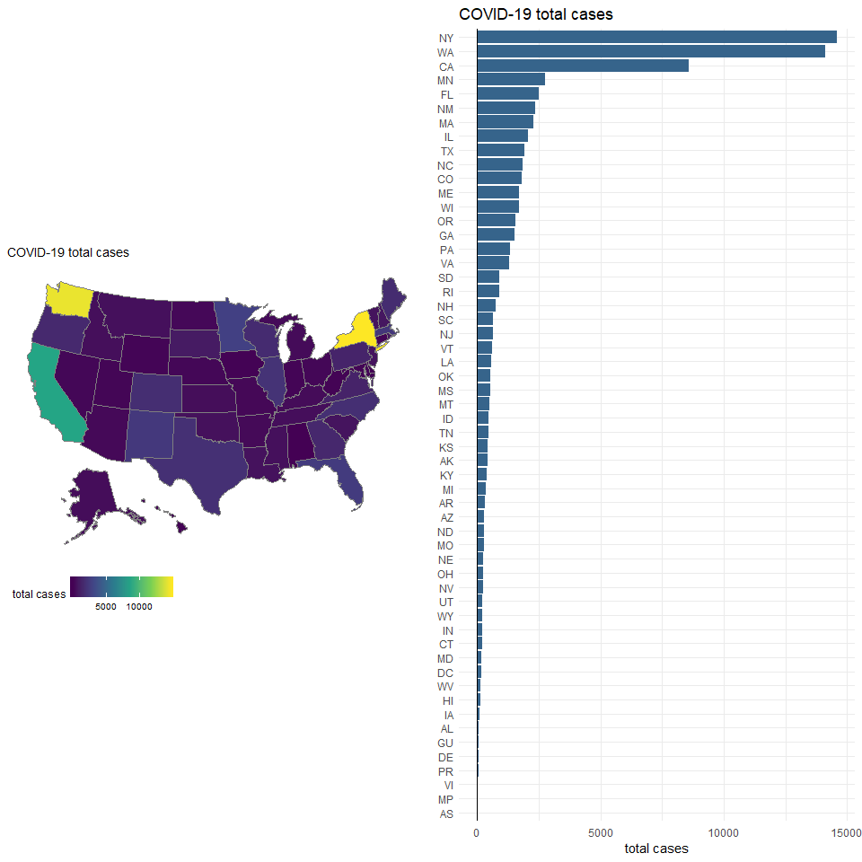
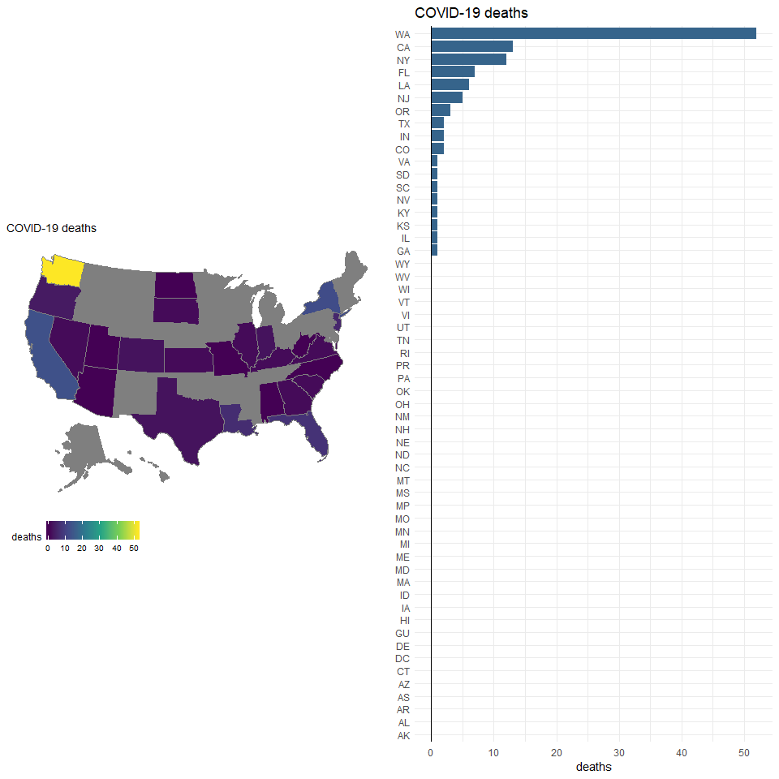

Below is some simple code to vizualize current COVID-19 numbers in the the United Stats based on data from https://covidtracking.com/.

## Data loading 

```r
library(tidyverse)
library(usmap)
library(cowplot)

df <- read_csv("https://covidtracking.com/api/states.csv")
```

## Total number of cases

```r
# map
ptotal <- plot_usmap(data = df, values = "total", lines = "gray50") +
  scale_fill_viridis_c(name = "total cases", option = 'viridis') + 
  theme(legend.position = "bottom") +
  ggtitle("COVID-19 total cases")

# bar plot 
tbar <- ggplot(df, aes(reorder(df$state, df$total), total)) + 
  geom_bar(stat = 'identity', fill='steelblue4') + 
  coord_flip() +
  theme_minimal()  +
  geom_hline(yintercept = 0) +
  labs(x=NULL, y = "total cases", title = "COVID-19 total cases")

# print plots
plot_grid(ptotal,tbar, ncol = 2)
```

<!-- -->


## Number of deaths 

```r
# map
pdeaths <- plot_usmap(data = df, values = "death", lines = "gray50") +
  scale_fill_viridis_c(name = "deaths", option = 'viridis') + 
  theme(legend.position = "bottom") +
  ggtitle("COVID-19 deaths")

# bar plot
df$death_nona <- ifelse(is.na(df$death) == TRUE, 0, df$death)

dbar <- ggplot(df, aes(reorder(df$state, df$death_nona), death_nona)) + 
  geom_bar(stat = 'identity', fill = 'steelblue4') + 
  coord_flip() +
  theme_minimal()  +
  geom_hline(yintercept = 0) +
  labs(x=NULL, y = "deaths", title = "COVID-19 deaths")


plot_grid(pdeaths, dbar, ncol = 2)
```

<!-- -->

